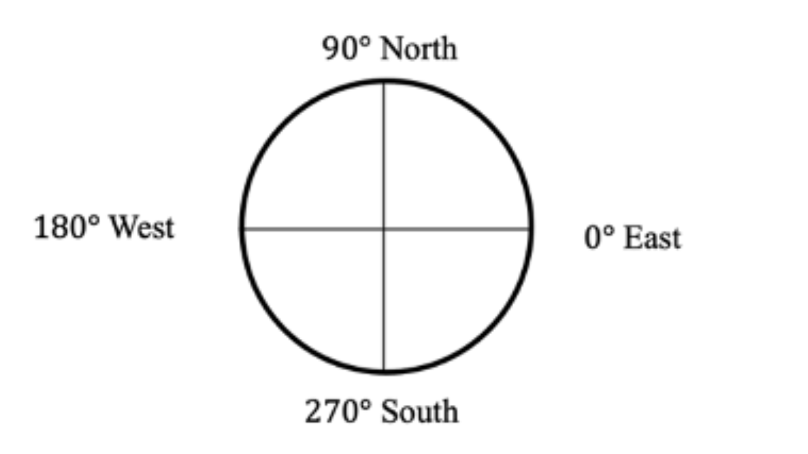
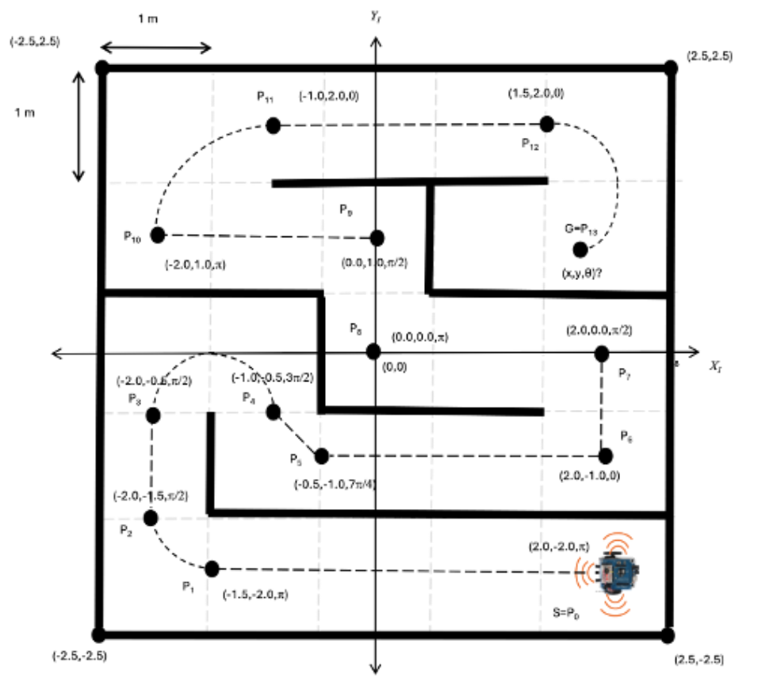

# HamBot Waypoint Navigation

This project programs the **HamBot** robot to follow a sequence of waypoints with a mix of straight lines, spins, and arcs.  
The motion has been scaled down so it fits inside a **small room**, while still keeping the geometry of the original route.

---

## 🚀 Features
- **Waypoint navigation** with fixed poses (x, y, θ).  
- **Straight motion** using forward-only wheel speeds.  
- **In-place spins** for heading changes.  
- **Arc motion** for curved segments, with curvature based on radius or given wheel speeds.  
- **Safe scaling** to reduce total distance (`PATH_SCALE`) and motor speed (`SPEED_SCALE`).  
- **P10 special behavior:** robot first spins 90° clockwise, then executes an arc.  
- **Final arc (P12→P13):** uses given left/right wheel speeds and time, but distance shrinks to fit your environment.

---

## 📐 Key Parameters
- `R_WHEEL = 0.045` m → wheel radius.  
- `AXLE_L  = 0.184` m → axle length (wheel separation).  
- `RPM_MAX = 75` → motor safety limit (from HamBot class).  
- `SPEED_SCALE = 0.35` → slows down all motion while preserving geometry.  
- `PATH_SCALE = 0.35` → shrinks all distances and radii.  

You can **tune `PATH_SCALE`** (0.25–0.50) to make the route smaller or larger depending on your test area.

### 🧭 Orientation Reference
This compass shows how robot headings (θ) are measured:



---

## 📍 Waypoints
The robot follows 13 key waypoints:

```
P0 = ( 2.0, -2.0, π)
P1 = (-1.5, -2.0, π)
P2 = (-2.0, -1.5, π/2)   <- arc
P3 = (-2.0, -0.5, π/2)
P4 = (-1.0, -0.5, 3π/2)  <- arc
P5 = (-0.5, -1.0, 7π/4)
P6 = ( 2.0, -1.0, 0)
P7 = ( 2.0,  0.0, π/2)
P8 = ( 0.0,  0.0, π)
P9 = ( 0.0,  1.0, π/2)
P10= (-2.0,  1.0, π)     <- spin + arc
P11= (-1.0,  2.0, 0)
P12= ( 1.5,  2.0, 0)     <- arc to P13
P13= computed from VR, VL, T
```

Arcs happen at:
- **P1→P2** (fixed radius arc)  
- **P3→P4** (fixed radius arc)  
- **P10→P11** (spin first, then arc)  
- **P12→P13** (given wheel speeds VR=0.24, VL=0.80, T=0.50)  

### 🖼️ Path Route Diagram


---

## ⚙️ How It Works
1. **Spin to bearing** if needed.  
2. **Move straight** between waypoints (scaled).  
3. **Spin to final heading** at each waypoint.  
4. **Arc segments** use constant curvature:
   - For fixed-radius arcs, curvature is set by `ARC_R_FIXED_ABS`.  
   - For the P12→P13 arc, wheel speeds & time are given and distance is scaled.  

---

## ▶️ Running the Code
1. Connect HamBot motors, IMU, and optionally Lidar/Camera.  
2. Place the robot in your room (make sure space is clear).  
3. Run:
   ```bash
   python3 navigate_waypoints.py
   ```
4. Watch the robot trace the scaled route.

---

## 🔧 Tips
- If the robot moves too far, **lower `PATH_SCALE`**.  
- If it moves too fast, **lower `SPEED_SCALE`**.  
- For smoother arcs, adjust `ARC_R_FIXED_ABS`.  
- You can disable Lidar/Camera by setting:
  ```python
  bot = HamBot(lidar_enabled=False, camera_enabled=False)
  ```
- To deploy and run your code on the HamBot:
  1. Turn on the HamBot and check the **IP address displayed on the robot’s LED**.  
  2. From your local computer, transfer the file using that IP (replace `<ROBOT_IP>`):
     ```bash
     scp ./navigate_waypoints.py hambot@<ROBOT_IP>:~/Desktop/
     ```
  3. Open **VNC Viewer** on your computer, enter `<ROBOT_IP>` to connect to the robot’s Raspberry Pi desktop.  
  4. Once connected via VNC, open a terminal on the robot’s desktop and run:
     ```bash
     cd ~/Desktop
     python3 navigate_waypoints.py
     ```

---

## 📄 File Overview
- `navigate_waypoints.py` → Main navigation logic.  
- `robot_systems/robot.py` → HamBot hardware wrapper (motors, IMU, etc.).  
