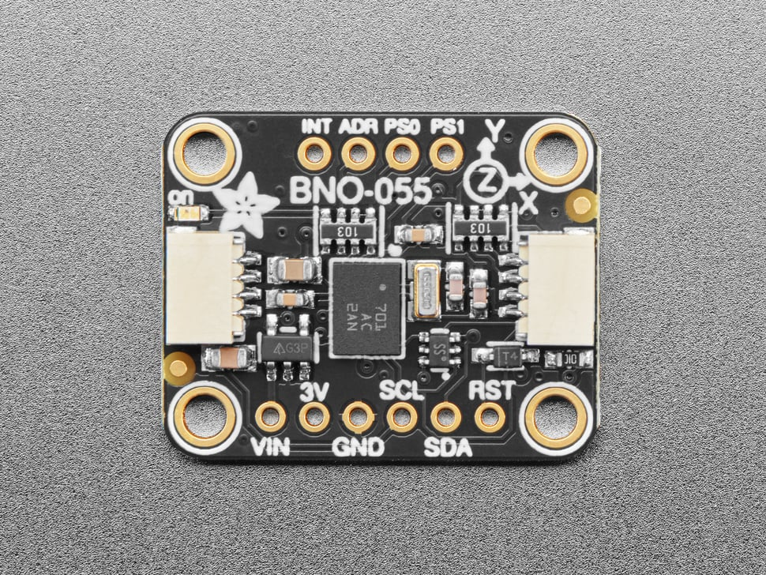

# IMU (BNO055) — Technical Documentation

The IMU provides orientation and motion data to HamBot using the **Adafruit BNO055** sensor over I²C. This module wraps the CircuitPython driver with a simple Python API tailored to our coordinate and heading conventions.

- **Sensor:** Adafruit BNO055
- **Bus:** I²C
- **Library:** `adafruit_bno055` (CircuitPython)
- **Mounting (per HamBot build):**
  - **x-axis** points **down** through the robot
  - **y-axis** runs **parallel to the left wheel axle**
  - **z-axis** points **forward** from the robot

---
[](https://learn.adafruit.com/adafruit-bno055-absolute-orientation-sensor/downloads)  
*Click the image to view the manufacturer datasheet.*
---

## Installation & Setup

### Enable I²C (Raspberry Pi OS)
```bash
sudo raspi-config  # Interface Options → I2C → Enable
sudo reboot
````

### Python Dependencies

Install into your project’s virtual environment:

```bash
pip install adafruit-circuitpython-bno055 adafruit-blinka
```

> Note: `board` comes via Blinka. Ensure you’re running on the Pi with I²C enabled.

---

## Coordinate & Heading Conventions

* **Heading:** `get_heading()` returns **degrees from East** in `[0, 360)`

  * 0° = East, 90° = North, 180° = West, 270° = South
* **Linear acceleration axes (per mounting):**

  * `x` → vertical (downward positive)
  * `y` → lateral (left-right across axle)
  * `z` → forward (robot’s forward direction)

---

## API Reference

```python
from robot_systems.imu import IMU
imu = IMU()
```

### Orientation & Motion

* `imu.get_euler_angles() -> (heading, roll, pitch)`
  Euler angles in **degrees** (sensor frame).
* `imu.get_quaternion() -> (x, y, z, w)`
  Orientation as a quaternion.

### Derived Heading

* `imu.get_heading() -> float`
  Heading in **degrees from East** (0–360), remapped from BNO055’s yaw.

### Acceleration & Rates

* `imu.get_linear_acceleration() -> (x, y, z)`
  m/s² with gravity removed.
* `imu.get_acceleration() -> (x, y, z)`
  Raw m/s² (includes gravity).
* `imu.get_gravity() -> (x, y, z)`
  Gravity vector in m/s².
* `imu.get_gyroscope() -> (x, y, z)`
  Angular velocity in **radians/s**.
* `imu.get_magnetometer() -> (x, y, z)`
  Magnetic field in µT.

### Convenience Accessors (aligned to HamBot axes)

* `imu.get_forward_acceleration() -> float`
  Returns **z** component (forward) from `linear_acceleration`.
* `imu.get_lateral_acceleration() -> float`
  Returns **y** component (lateral).
* `imu.get_vertical_acceleration() -> float`
  Returns **x** component (vertical).

### Sensor Status

* `imu.get_temperature() -> float`
  Sensor temperature in °C.
* `imu.get_calibration_status() -> (sys, gyro, accel, mag)`
  Calibration levels (0–3 each).

---

## Examples

### 1) Basic Orientation Readout

```python
from robot_systems.imu import IMU

imu = IMU()
h, r, p = imu.get_euler_angles()
print(f"Euler: heading={h:.1f}°, roll={r:.1f}°, pitch={p:.1f}°")

east_heading = imu.get_heading()
print(f"Heading (deg from East): {east_heading:.1f}")
```

### 2) Motion Features Aligned to Robot

```python
from robot_systems.imu import IMU
imu = IMU()

ax = imu.get_vertical_acceleration()  # x (downward)
ay = imu.get_lateral_acceleration()   # y (lateral)
az = imu.get_forward_acceleration()   # z (forward)

print(f"Vertical: {ax:.3f} m/s^2, Lateral: {ay:.3f} m/s^2, Forward: {az:.3f} m/s^2")
```

### 3) Calibration Check

```python
from robot_systems.imu import IMU
imu = IMU()
sys, g, a, m = imu.get_calibration_status()
print(f"Calibration (sys,gyro,accel,mag) = {sys},{g},{a},{m}")
```

---

## Calibration & Usage Notes

* **Calibration:**
  The BNO055 reports calibration for system, gyro, accelerometer, and magnetometer (0–3). For reliable heading, aim for **3** on all fields. Move/rotate the robot slowly in different orientations to complete calibration.
* **Heading Stability:**
  If heading drifts, confirm calibration status and keep ferromagnetic materials and high-current wires away from the sensor.
* **None values:**
  Some BNO055 fields may transiently return `None` right after boot. Add simple guards/retries in time-critical loops.
* **Mounting alignment:**
  The convenience accessors (`get_forward_acceleration`, etc.) assume the IMU is mounted as specified above. Update the mapping if your mounting changes.

---

## Troubleshooting

* **No I²C device:**
  Ensure I²C is enabled and wiring is correct (SDA/SCL). Check with `i2cdetect -y 1`.
* **Import errors:**
  Verify installs of `adafruit-circuitpython-bno055` and `adafruit-blinka` in your active venv.
* **Jittery readings:**
  Dampen with simple low-pass filtering or average multiple samples if needed.

---

