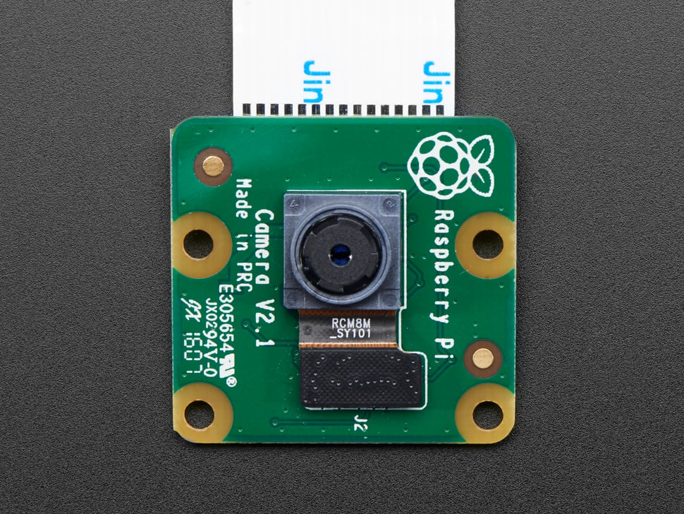

# Camera — Technical Documentation

The camera module provides threaded RGB capture using OpenCV and simple color-based landmark detection (via RGB thresholding). It is designed for low-overhead perception tasks such as colored landmark tracking.

- **Backend:** OpenCV (`cv2.VideoCapture`)
- **Default FPS:** 5 (configurable)
- **Default Resolution:** 640×480 (configurable)
- **Image format:** `numpy.ndarray` in **RGB** order (H, W, 3)

---
[](https://www.raspberrypi.com/documentation/accessories/camera.html)  
*Click the image to view the manufacturer datasheet.*
---

## Dependencies
- `opencv-python`
- `numpy`

Install:
```bash
pip install opencv-python numpy
````

## API Reference

```python
from robot_systems.camera import Camera

cam = Camera(fps=5, camera_index=0, resolution=(640, 480))
```

### Constructor

* `Camera(fps=5, camera_index=0, resolution=(640, 480))`

  * Opens a camera device with OpenCV and starts a background thread that continuously grabs frames.

### Methods

* `get_image() -> np.ndarray | None`
  Returns the latest RGB frame (shape `(H, W, 3)`), or `None` if not yet available.

* `set_landmark_colors(colors, tolerance=0.05)`
  Set one or more target colors for detection.

  * `colors`: `(R, G, B)` tuple or list of tuples (0–255 per channel)
  * `tolerance`: float in `[0, 1]` interpreted as a symmetric ±tolerance around each channel.

* `find_landmarks(area_threshold=500) -> list[Landmark]`
  Performs color thresholding over the configured color set and returns a list of detected regions larger than `area_threshold` (in pixels²).
  Each `Landmark` has:

  * `x, y`: center pixel coordinates
  * `width, height`: bounding box dimensions
  * `r, g, b`: sampled RGB values at the center

* `stop_camera()`
  Stops the capture thread and releases the camera device.

## Landmarks

When `Camera.find_landmarks()` detects a color region that matches the configured RGB ± tolerance, it creates one or more **Landmark** objects.

### Landmark Class

```python
class Landmark:
    def __init__(self, center_x, center_y, width, height):
        """
        Represents a detected color region (bounding box).

        Args:
            center_x (int): x-coordinate of the region’s center (pixels).
            center_y (int): y-coordinate of the region’s center (pixels).
            width (int): Width of the bounding box (pixels).
            height (int): Height of the bounding box (pixels).
        """
````

A `Landmark` has the following attributes:

* `center_x`, `center_y`: Pixel coordinates of the region’s center.
* `width`, `height`: Size of the bounding box.

The class also implements `__repr__` for easy printing:

```python
Landmark(center=(x, y), width=w, height=h)
```

### Example Usage

```python
from robot_systems.camera import Camera

cam = Camera()
cam.set_landmark_colors([(255, 0, 0)], tolerance=0.08)  # detect red
landmarks = cam.find_landmarks()

for lm in landmarks:
    print(f"Found landmark at ({lm.center_x}, {lm.center_y}) with size {lm.width}x{lm.height}")
```

### Notes

* Multiple landmarks may be returned if more than one region matches the detection criteria.
* Use the bounding box size (`width × height`) or contour area to filter out small false positives.
* Coordinates are in **pixel space** relative to the camera frame, not world coordinates.
---

## Usage Examples

### 1) Basic Capture

```python
from robot_systems.camera import Camera
import time

cam = Camera(fps=5, camera_index=0, resolution=(640, 480))
time.sleep(0.5)  # give the thread a moment to grab a frame
img = cam.get_image()
print(None if img is None else img.shape)  # e.g., (480, 640, 3)
cam.stop_camera()
```

### 2) Detect Green Landmarks

```python
from robot_systems.camera import Camera

cam = Camera(fps=5)
cam.set_landmark_colors([(0, 255, 0)], tolerance=0.08)  # detect green ±8%
landmarks = cam.find_landmarks(area_threshold=400)
print("Detected:", landmarks)
cam.stop_camera()
```

### 3) Multiple Colors

```python
from robot_systems.camera import Camera
# red, green, blue
colors = [(255, 0, 0), (0, 255, 0), (0, 0, 255)]

cam = Camera()
cam.set_landmark_colors(colors, tolerance=0.06)
for lm in cam.find_landmarks():
    print(lm)
cam.stop_camera()
```

## How Color Detection Works

1. Convert the captured frame to **RGB** (already done in `Camera._capture_images`).
2. For each target color `(R,G,B)`, build lower/upper bounds by applying ±`int(255 * tolerance)` per channel.
3. Threshold (`cv2.inRange`) to obtain a mask; combine masks for multiple colors.
4. Find contours on the combined mask and filter by `area_threshold`.
5. For each region, compute bounding box, center, and sample the center’s RGB.

## Performance Tips

* Lower resolution (e.g., `resolution=(320, 240)`) for faster detection on small SBCs.
* Tune `tolerance` and `area_threshold` to reduce false positives.
* If you need higher frame rates, raise `fps` and ensure the platform can sustain the I/O.

## Troubleshooting

* **“Could not open camera”**: Check `camera_index` (try 0/1), device permissions, or that no other process holds the camera.
* **`get_image()` returns `None`**: Give the thread a brief moment after construction, or ensure the camera is streaming.
* **Wrong colors**: Remember frames are RGB inside this class (OpenCV native capture is BGR; the class converts to RGB).

---
# Camera RGB Picker — Utility

`cameraGUI.py` is a small Tkinter + OpenCV tool to help you discover RGB values and an appropriate tolerance for landmark detection. It shows a live camera feed; you can adjust sliders or click on the video to sample a pixel’s color.

## Dependencies
- `opencv-python`
- `numpy`
- `tkinter` (usually provided by the OS)

Install:
```bash
pip install opencv-python numpy
````

## Run

```bash
python cameraGUI.py
```

## Features

* Live video at 320×240 for responsiveness.
* Sliders for R, G, B, and Tolerance (%).
* Click on the frame to sample a pixel’s RGB into the sliders.
* Bounding boxes drawn over regions matching the current `(R,G,B)` ± tolerance.
* “Quit” button and clean shutdown of camera and GUI.

## Notes

* The utility flips the preview vertically to match prior behavior; detection runs on the RGB-converted frame.
* If no GUI is available, the script will not be able to show the preview window; run from a desktop session or with X forwarding if needed.
