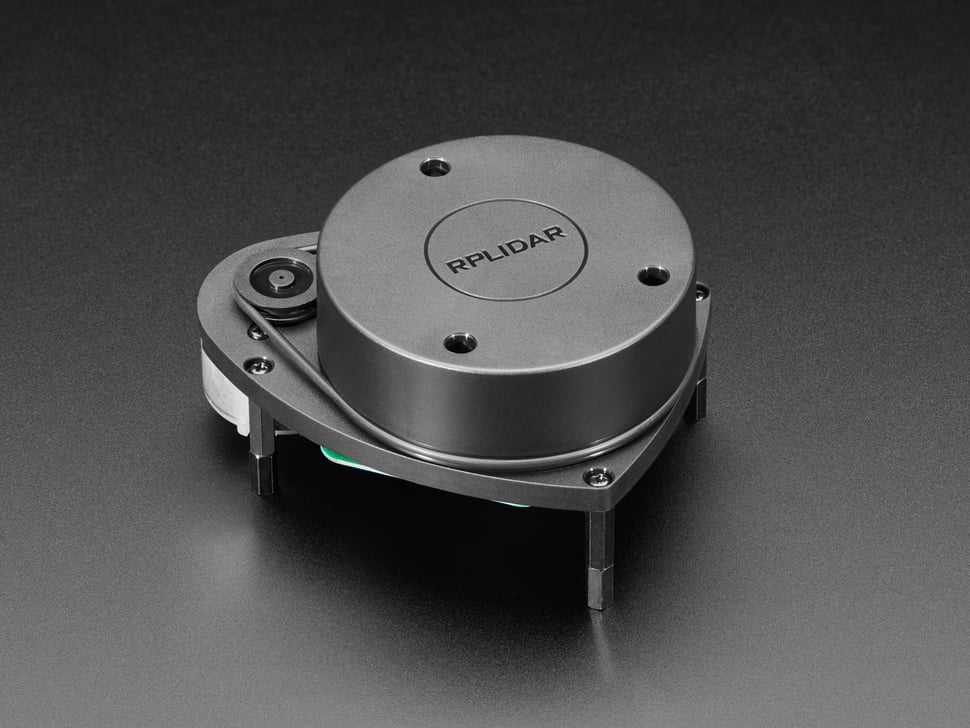

# LiDAR — Technical Documentation

The LiDAR module provides a threaded interface to the **Slamtec RPLidar** sensor via the Adafruit CircuitPython driver. It continuously scans the environment and maintains a 360° range image for the robot.

- **Sensor:** Slamtec RPLidar (A1/A2 family supported)
- **Library:** `adafruit_rplidar`
- **Data Format:** 360-element list, where each index corresponds to a degree angle.

---
[](https://learn.adafruit.com/slamtec-rplidar-on-pi)  
*Click the image to view the manufacturer datasheet.*
---

## Installation & Setup

### Dependencies
```bash
pip install adafruit-circuitpython-rplidar
````

## Orientation Conventions

* Index `0` → **rear** of the robot
* Index `90` → **left**
* Index `180` → **front**
* Index `270` → **right**

These mappings are handled automatically inside the class.

---

## API Reference

```python
from robot_systems.lidar import Lidar
lidar = Lidar(port_name="/dev/ttyUSB0", timeout=3, frequency=20)
```

### Constructor

* `Lidar(port_name="/dev/ttyUSB0", timeout=3, frequency=20)`

  * `port_name`: USB port where the LiDAR is connected.
  * `timeout`: Connection timeout (s).
  * `frequency`: How often to update (Hz). Controls the sleep between scan loops.

### Methods

* `get_current_scan() -> list[int]`
  Returns a **copy** of the latest 360-length distance array (in mm). Each index = angle.

* `set_lidar_frequency(freq: float)`
  Adjusts the scan loop sleep frequency.

* `stop_lidar()`
  Gracefully shuts down: stops thread, motor, and disconnects USB.

---

## Example Usage

### 1) Basic Scan

```python
from robot_systems.lidar import Lidar
import time

lidar = Lidar()
time.sleep(1)  # allow buffer to fill
scan = lidar.get_current_scan()

print("Front distance (mm):", scan[180])
print("Left distance (mm):", scan[90])

lidar.stop_lidar()
```

### 2) Continuous Readout

```python
from robot_systems.lidar import Lidar
import time

lidar = Lidar()
try:
    while True:
        scan = lidar.get_current_scan()
        print(f"Front: {scan[180]} mm, Right: {scan[270]} mm")
        time.sleep(0.5)
finally:
    lidar.stop_lidar()
```

---

## How It Works

1. Starts the RPLidar motor and spawns a background thread.
2. Calls `iter_scans()` from `adafruit_rplidar`.
3. For each measurement:

   * Adjusts angle so that `180°` is front, `0°` is rear.
   * Floors and clamps to the nearest degree.
   * Updates the `scan_data` array with distance in mm.
4. Data is protected with a lock for thread-safe reads.

---

## Performance Tips

* Default frequency is 20 Hz (`lidar_sleep = 1/20`). Lower if CPU is limited.
* Always call `stop_lidar()` before program exit to stop the motor and free USB.

---

## Troubleshooting

* **`RPLidar exception occurred`**:
  Check wiring, USB cable, and power supply. Some hubs cannot supply enough current.
* **No device found**:
  Ensure the LiDAR is visible under `/dev/ttyUSB*`. Add user to `dialout` group.
* **Laggy updates**:
  Lower `frequency` to reduce CPU usage.

---

