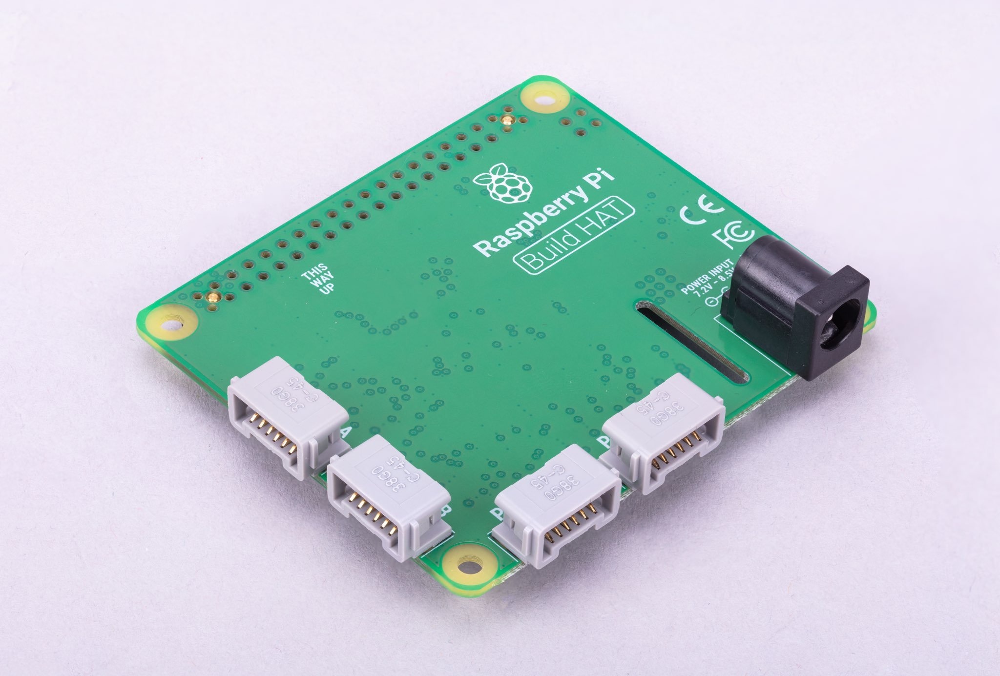
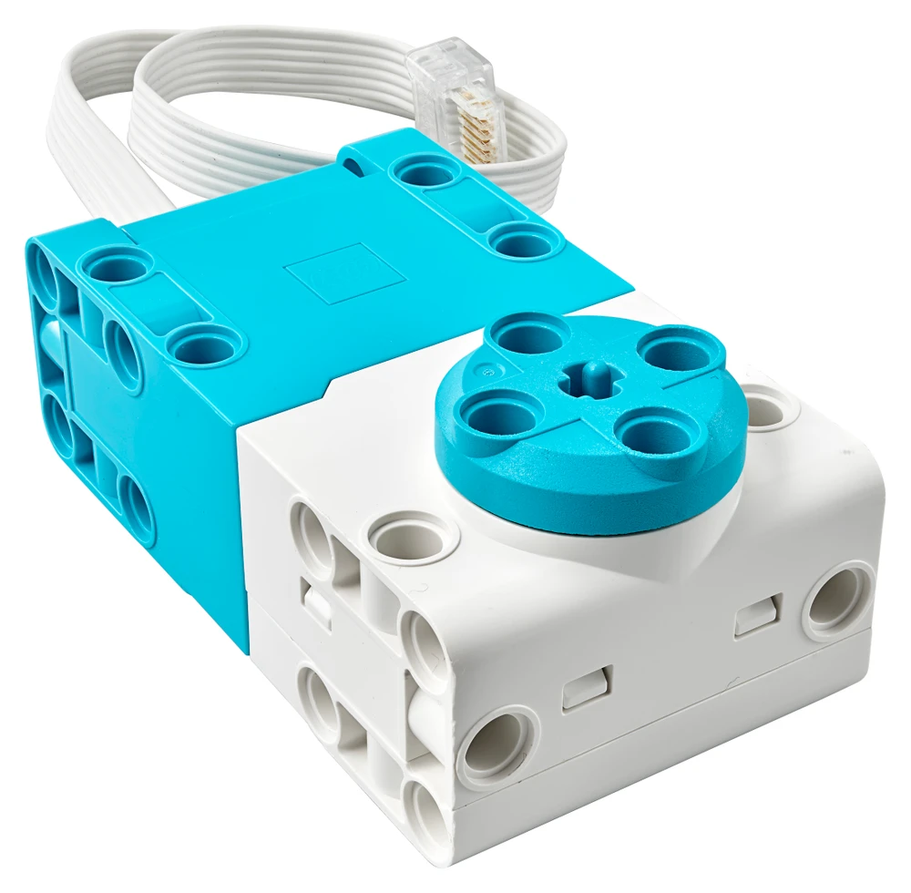

# Motors — Technical Documentation

HamBot uses LEGO motors controlled via the **Raspberry Pi Build HAT**. The Build HAT board connects directly to a Raspberry Pi and provides four LEGO® Technic™ ports for motors and sensors.

- **Library:** `buildhat`
- **Motors Supported:** LEGO Technic Medium Angular Motor, Large Angular Motor, and compatible PoweredUp motors.
- **Ports:** A, B, C, D

[](https://www.raspberrypi.com/documentation/accessories/build-hat.html)

[](https://le-www-live-s.legocdn.com/sc/media/files/support/spike-prime/techspecs_techniclargeangularmotor-1b79e2f4fbb292aaf40c97fec0c31fff.pdf)  
*Click the image to view the manufacturer datasheet.*

---

## Installation & Setup

### Dependencies
The Build HAT library is installed via pip:
```bash
pip install buildhat
````

On Raspberry Pi OS, the Build HAT service is usually preinstalled. If not:

```bash
sudo apt install python3-buildhat
```

---

## Motor Class (from `buildhat`)

The `Motor` class provides low-level access to LEGO motors.

### Constructor

```python
from buildhat import Motor
motor = Motor('A')  # connect motor to port A
```

Arguments:

* `'A'`, `'B'`, `'C'`, or `'D'` — the physical port on the Build HAT.

---

## API Reference

### Basic Movement

* `motor.start(speed)`
  Starts the motor running at the given speed.

  * `speed`: range `-100` to `100` (% of max power). Negative = reverse.

* `motor.stop()`
  Stops the motor.

* `motor.run_to_position(position, speed)`
  Rotates to an **absolute position** (degrees, relative to motor’s zero point).

* `motor.run_for_degrees(degrees, speed)`
  Rotates motor a given number of **degrees** from current position.

* `motor.run_for_seconds(seconds, speed)`
  Rotates motor for a fixed duration.

### Reading Motor State

* `motor.get_aposition()`
  Returns the **absolute position** (in degrees, wraps at ±180).

* `motor.get_position()`
  Returns the current relative position (can be reset).

* `motor.was_stalled()`
  Returns `True` if the motor stalled on last command.

---

## Usage Examples

### 1) Simple Forward and Stop

```python
from buildhat import Motor
import time

left_motor = Motor('A')
right_motor = Motor('B')

# Drive forward
left_motor.start(-50)   # left motor reversed for forward
right_motor.start(50)   # right motor forward
time.sleep(2)

# Stop
left_motor.stop()
right_motor.stop()
```

### 2) Move a Set Distance

```python
from buildhat import Motor

left_motor = Motor('A')
right_motor = Motor('B')

# Rotate 720° at speed 75
left_motor.run_for_degrees(-720, 75)
right_motor.run_for_degrees(720, 75)
```

### 3) Read Position Continuously

```python
from buildhat import Motor
import time

motor = Motor('A')

while True:
    pos = motor.get_aposition()
    print(f"Absolute Position: {pos}")
    time.sleep(0.1)
```

---

## Notes for HamBot

* **Direction convention:**

  * Left motor must run at **negative speed** to move forward.
  * Right motor runs at **positive speed** for forward.
  * This is due to mirrored mounting.
* **Encoders:**
  Every motor has an internal encoder; values range from `-180` to `180`. Wrap-around logic is needed when integrating rotations.
* **Battery considerations:**
  The Build HAT requires a **7.5V–12V external power supply** to drive motors effectively.

---

## Troubleshooting

* **Motor not moving:**

  * Check power supply to Build HAT.
  * Confirm motor cable is securely connected to port.
* **Stalling:**
  If the motor stalls, lower the commanded speed or check for mechanical blockage.
* **Permissions error:**
  Ensure the Build HAT service is running:

  ```bash
  sudo systemctl status buildhat
  ```


